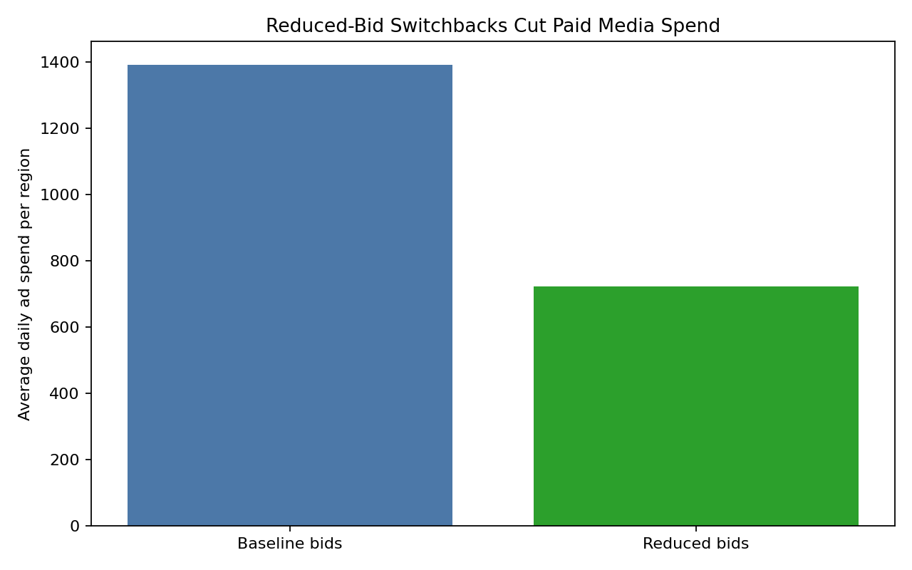
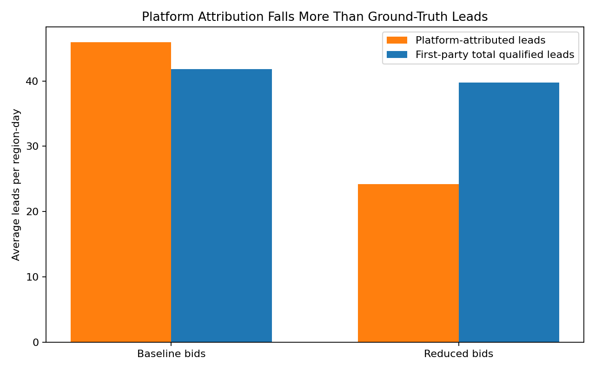
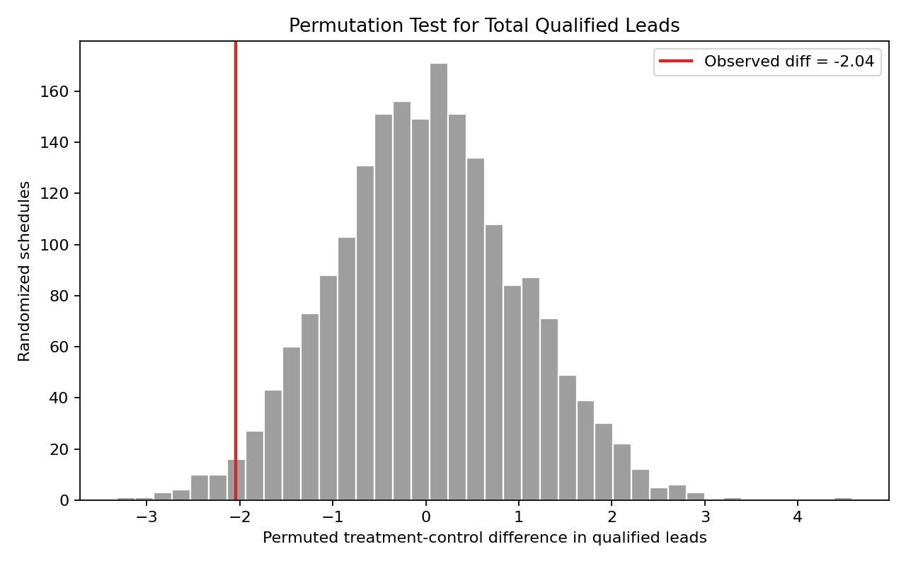
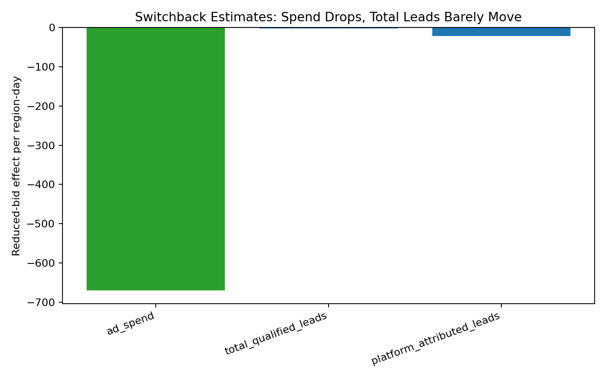

# Air Force Recruiting Switchback Experiment

This portfolio project adapts marketplace switchback experimentation to a public-sector recruiting use case.

## Business Question

An Air Force recruiting analytics team wants to know:

> Can we reduce paid media bids without materially reducing total qualified recruiting leads?

Ad platforms may claim credit for leads that would have arrived through organic search, direct traffic, referrals, or existing recruiting interest. The goal is to evaluate the policy using **first-party total qualified leads**, not only platform-attributed conversions.

## Experiment Design

The simulation uses a randomized **region-day switchback experiment**:

- Unit of randomization: recruiting region by day
- Control condition: baseline paid-media bids
- Treatment condition: reduced-bid policy
- Primary outcome: total qualified recruiting leads from first-party CRM-style data
- Secondary outcomes: ad spend, platform-attributed leads, cost per qualified lead

This design is useful when user-level A/B testing is not available because marketplace or advertising systems expose all users in the same region/time window to the same auction environment.

## Methods

The project compares dashboard-style attribution against causal measurement:

1. Simulate recruiting demand, paid media spend, and platform-attributed leads.
2. Randomize reduced-bid policy across region-days.
3. Estimate treatment effects using OLS with region and day-of-week fixed effects.
4. Run a permutation/randomization-inference test by shuffling assignments within recruiting regions.
5. Compare paid-platform attributed leads to first-party total qualified leads.

## Current Results

Average observed differences on reduced-bid region-days:

- Ad spend saved per region-day: `$669.42`
- Change in first-party total qualified leads per region-day: `-2.04`
- Change in platform-attributed leads per region-day: `-21.74`
- Baseline cost per qualified lead: `$33.35`
- Reduced-bid cost per qualified lead: `$18.22`
- Permutation-test p-value for total qualified leads: `0.043`

## Key Lesson

A platform dashboard can make reduced bids look harmful because attributed leads fall sharply. But if total qualified leads move much less while spend drops, the campaign may have been cannibalizing organic or direct recruiting interest.

## Visualizations

### Ad Spend by Policy



### Platform-Attributed vs Total Qualified Leads



### Permutation Test



### Switchback Effects



## Repository Structure

```text
.
├── src/
│   └── airforce_recruiting_switchback.py
├── data/
│   └── airforce_recruiting_switchback_data.csv
├── artifacts/
│   ├── ad_spend_by_policy.png
│   ├── attributed_vs_total_leads.png
│   ├── permutation_test_total_leads.png
│   └── switchback_effects.png
├── reports/
│   ├── model_results.md
│   ├── permutation_null_distribution.csv
│   └── switchback_effect_estimates.csv
└── requirements.txt
```

## How to Run

```bash
pip install -r requirements.txt
python src/airforce_recruiting_switchback.py
```

If running from the parent `Data_Science` virtual environment:

```bash
../.venv/bin/python src/airforce_recruiting_switchback.py
```

## Portfolio Takeaway

This project shows how switchback experiments can help evaluate advertising incrementality when standard user-level A/B testing is unavailable. It also demonstrates why first-party outcomes are often more reliable than platform attribution for budget decisions.
