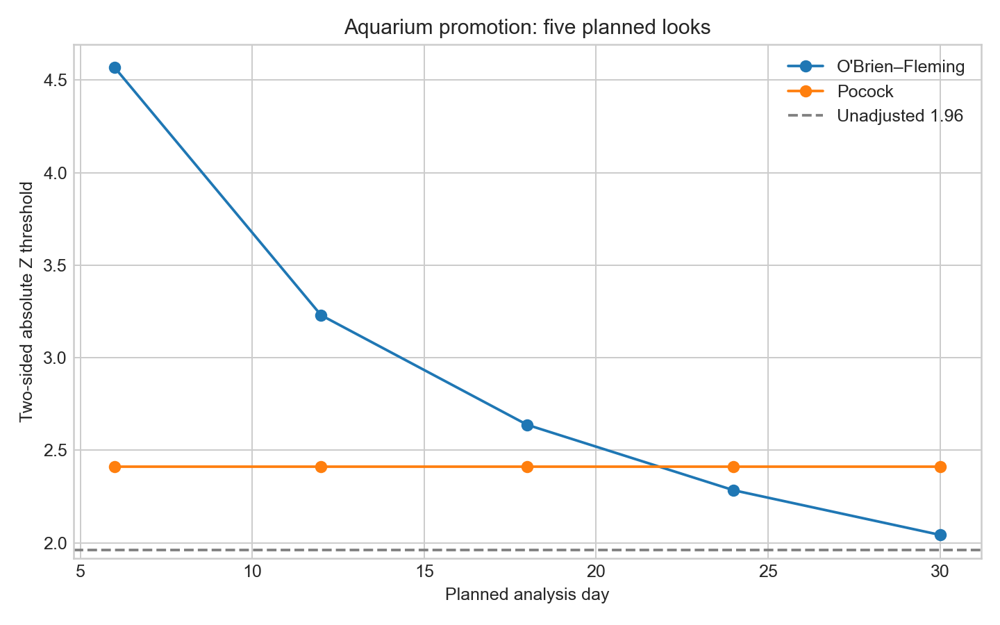
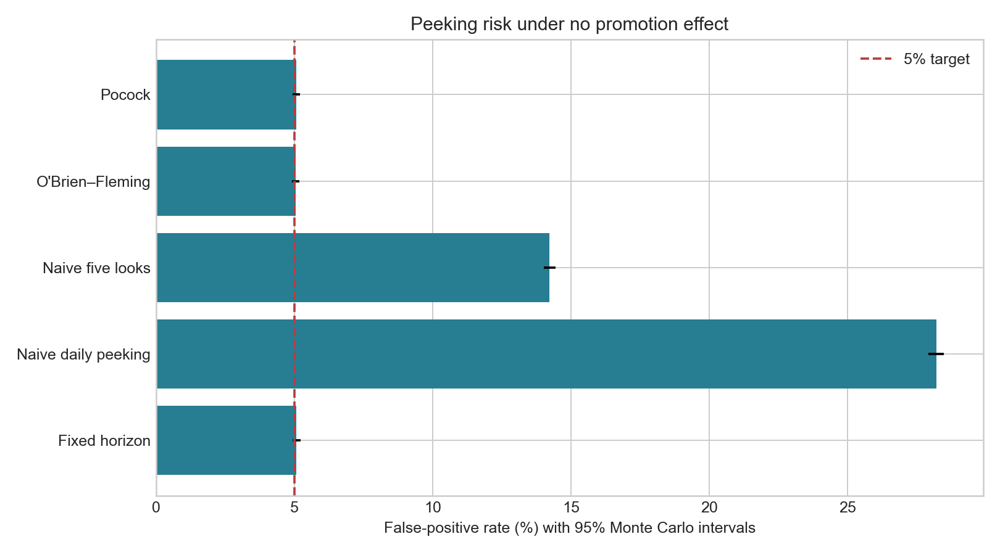
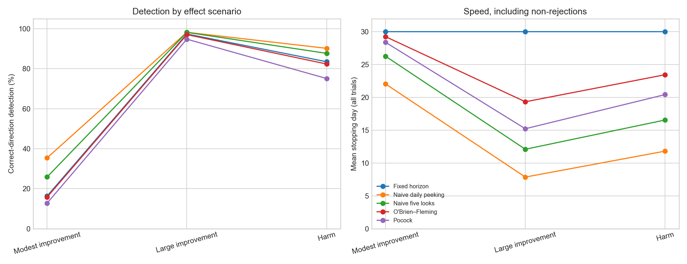

# Aquarium Store Sequential Testing

An original synthetic experiment asking: **Can an aquarium store monitor a promotion during a 30-day test without repeatedly mistaking noise for a spending lift?**

## Business setting

A fictional aquarium retailer tests a fish-food/accessory promotional offer against its usual shopping experience. The endpoint is net spending per randomized eligible customer during a fixed observation window, including zero spending for nonbuyers—not spending conditional on purchase. The control mean is $45; the assumed customer-level standard deviation is $25. Each day supplies 40 fully observed, independent customers per arm, for a maximum of 2,400 customers.

These are invented planning assumptions, not actual store data. The simulation models **daily aggregate mean differences using a Gaussian approximation**, not individual transaction histories. The illustrative aggregate CSV is separate from the Monte Carlo study.

## Pre-specified design

- Two-sided experiment-wide alpha: 5%; a positive crossing indicates benefit and a negative crossing indicates harm to spending.
- Planned sequential looks: days 6, 12, 18, 24, and 30, at 20%, 40%, 60%, 80%, and 100% information.
- Scenarios: no effect, +$1 modest improvement, +$4 large improvement, and −$3 harm per customer.
- Stop on the **first** boundary crossing; otherwise complete day 30 with no rejection.
- No futility stopping, adaptive sample-size changes, or extra looks for the calibrated methods.

| Method | Analysis schedule | Threshold |
|---|---|---|
| Fixed horizon | Day 30 only | 1.960 |
| Naive daily peeking | Every day | 1.960 each time |
| Naive five looks | Five planned days | 1.960 each time |
| O’Brien–Fleming | Five planned days | c / sqrt(information fraction) |
| Pocock | Five planned days | Constant c |

Both sequential designs use the same maximum sample size as the fixed-horizon test. They are **not** re-sized to have identical power.

## Statistical construction

Let t be the accumulated information fraction. The simulated process is

`Z(t) = B(t) / sqrt(t) + (effect / final_SE) * sqrt(t)`

where B has independent Gaussian increments with variance equal to each information increment. Thus `Corr(Z(s), Z(t)) = sqrt(s/t)` for s ≤ t, rather than treating repeated looks as independent tests. The final standard error is `25 * sqrt(2/1200) ≈ $1.021`.

Use 500,000 null paths to calibrate the 95th percentile of:

- O’Brien–Fleming: `max(abs(Z(t)) * sqrt(t))`
- Pocock: `max(abs(Z(t)))`

Then evaluate all methods on **100,000 new paths per scenario**, using independent random streams for calibration, evaluation, and illustrative data. Within each scenario, methods share paths for fair comparisons. These are Monte Carlo approximations to classical group-sequential boundary shapes, not copied published constants or an exact alpha-spending implementation. Boundaries depend on the planned information schedule; changing it requires recalibration.

## Results from the default run

| Method | Null false-positive rate |
|---|---:|
| Fixed horizon | 5.07% |
| Naive daily peeking | 28.20% |
| Naive five looks | 14.22% |
| O’Brien–Fleming | 5.04% |
| Pocock | 5.06% |

For the +$4 promotion, Pocock stops at **15.23 days on average**, versus **19.34** for O’Brien–Fleming, but detects the positive effect less often: **94.76% versus 97.04%**. For +$1, correct-direction detection is only **12.76% and 15.77%**, respectively: this modest effect is underpowered under the chosen traffic budget.

Under −$3 harm, average treatment exposure is **817 customers with Pocock**, **938 with O’Brien–Fleming**, and **1,200 at fixed horizon**. This measures exposure until the experiment ends, not post-test deployment or realized financial savings.

See [the generated report](reports/results.md) for Monte Carlo confidence intervals and all scenarios, [boundary values](reports/boundaries.csv), and [full operating characteristics](reports/operating_characteristics.csv).





## Decision implications and limitations

- Prefer O’Brien–Fleming when final-analysis sensitivity matters more than early action; consider Pocock when earlier detection of large benefits or harms is valuable.
- No significance is **not** proof of no effect. A negative crossing is evidence of spending harm, not a generic rule to “kill a dud.”
- Error control is approximate under this known-variance Gaussian model. Real spending is skewed and zero-inflated; validate with realistic customer-level distributions and variance estimation before operational use.
- Repeat shoppers, delayed outcomes, variable traffic, seasonality, and correlated observations can invalidate the assumed information process. Analyze fully matured outcomes and plan around information, not calendar days alone.
- Ordinary fixed-horizon p-values and confidence intervals at the selected stopping time are not sequentially valid. This project reports operating characteristics, not post-selection effect intervals.
- Spending lift does not establish profit lift; discount costs, margins, retention, and multiple guardrails require separate treatment. These boundaries do not replace operational safety monitoring.
- Reported intervals quantify evaluation Monte Carlo uncertainty conditional on calibrated boundaries, not uncertainty in calibration or business assumptions. Rates need not reproduce another article's simulation.

## Reproduce

From `Data_Science/` using its existing environment:

```bash
.venv/bin/python Aquarium_Store_Sequential_Testing/src/sequential_testing.py
.venv/bin/python -m unittest discover -s Aquarium_Store_Sequential_Testing/tests -v
```

Or create a Python environment, install `requirements.txt`, and run `python src/sequential_testing.py` from this folder. Output paths are relative to the script's project directory, not your working directory. Dependencies are compatible ranges; `reports/run_metadata.json` records the seed, settings, and selected package versions. Generated files are overwritten on rerun.

Optional settings:

```bash
python src/sequential_testing.py --trials 100000 --calibration-trials 500000 --seed 20260915
```

Tests cover first-crossing decisions, no-crossing completion, valid information schedules, reproducibility, the single-look limit, boundary shapes, correlation, and independent null calibration checks.

## Files

- `src/sequential_testing.py`: simulation, calibration, tables, plots, and report generation
- `tests/test_sequential_testing.py`: deterministic and statistical checks
- `data/example_daily_aggregates.csv`: independent illustrative synthetic aggregate dataset
- `reports/`: results, boundary table, operating characteristics, run metadata
- `artifacts/`: three generated visualizations

## Inspiration

Conceptual inspiration: [Beyond the Peek: Using Sequential Boundaries to Protect Experiment Integrity](https://whatstheimpact.com/blog/sequential-boundaries-experiment-peeking/) (article text supplied by the user). The aquarium scenario, implementation, parameters, simulations, and outputs here are original; no article data or numerical results are reused.
