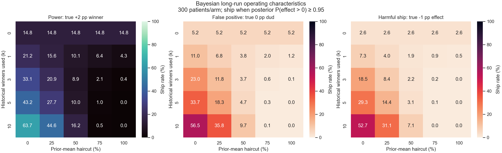
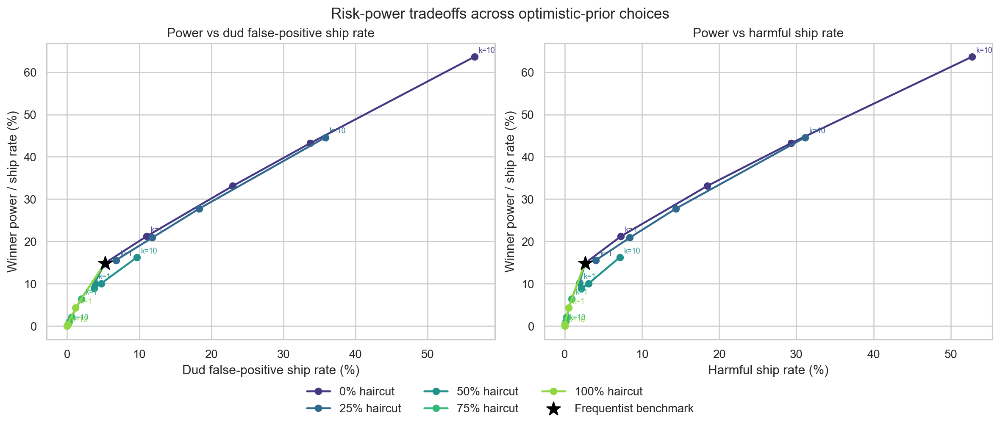

# Bayesian Healthcare A/B Testing: The False-Positive Trap

This synthetic simulation studies a low-traffic appointment-reminder experiment where an optimistic prior learned from real historical winners may improve power while also making null or harmful new tests easier to ship.

No real patient data are used. This is a methodological portfolio project, not clinical evidence and not a claim of HIPAA compliance.

## Decision question

Each randomized experiment has 300 patients in control and 300 in treatment. The control appointment-completion rate is 20%. Three independent types of new experiments are simulated:

- **Winner:** a true +2 percentage-point effect (22% treatment rate)
- **Dud:** a true 0-point effect (20% treatment rate)
- **Harmful:** a true -1-point effect (19% treatment rate)

The operational question is whether to ship the tested reminder.

## Methods

### Frequentist benchmark

For each simulated experiment, the difference in observed proportions is divided by its unpooled Wald standard error. The reminder ships when a one-sided 5% z-test rejects zero in favor of a positive effect (`z > 1.645`). Its winner ship rate is power; its dud ship rate is the false-positive rate. This directional threshold aligns with the Bayesian rule `P(effect > 0 | data) >= 0.95` when no historical information is used.

### Bayesian empirical optimistic prior

Historical experiments independently have a genuine +2-point effect and the same 300-per-arm design. For each Monte Carlo repetition, `k` historical effect estimates are averaged. The prior is

```text
effect ~ Normal((1 - haircut) × historical mean,
                historical planning variance / k)
```

where the planning variance is the binomial difference-in-proportions variance at control rate 20% and treatment rate 22%. The current estimate uses the normal likelihood

```text
current estimate | effect ~ Normal(effect, observed Wald SE²).
```

Normal-normal conjugacy gives the posterior analytically. The Bayesian rule ships when `P(effect > 0 | data) >= 0.95`.

The grid uses `k = 0, 1, 3, 5, 10` and prior-mean haircuts of 0%, 25%, 50%, 75%, and 100%. `k=0` is the flat-prior limit. A 100% haircut centers the prior at zero but retains historical precision, so it does not discard the historical information.

## Simulation design

- Fixed seed: `20250308`
- Monte Carlo repetitions: 50,000 per scenario
- Binary outcomes generated from binomial arm totals
- Historical and new experiments generated independently
- Entire analysis uses synthetic data

The reported Bayesian false-positive and harmful ship rates are **long-run operating characteristics** under repeated simulation. They are not posterior probabilities that a particular result is false or harmful.

## Results

Exact generated values and Monte Carlo standard errors are in [`reports/model_results.md`](./reports/model_results.md) and the CSV reports.

### Bayesian operating-characteristic heatmaps



### Risk-power tradeoffs



## Project structure

```text
.
├── src/
│   └── simulate_ab_testing.py
├── data/
│   └── simulation_scenarios.csv
├── artifacts/
│   ├── bayesian_operating_characteristics_heatmaps.png
│   └── risk_power_tradeoff.png
├── reports/
│   ├── operating_characteristics.csv
│   ├── bayesian_risk_power_matrix.csv
│   ├── historical_prior_summary.csv
│   └── model_results.md
├── .gitignore
├── README.md
└── requirements.txt
```

## Run

From this project directory, use the repository's existing virtual environment:

```bash
../.venv/bin/python src/simulate_ab_testing.py
```

The script recreates all CSV reports, the Markdown summary, and both PNG plots. Runtime is kept modest by vectorizing 50,000 Monte Carlo repetitions with NumPy.

## Takeaway

Borrowing optimistic historical evidence is a decision-policy choice, not free power. Its value depends on how much historical information is used and how strongly its mean is discounted. The heatmaps and tradeoff plot make both the increased winner ship rate and the corresponding long-run dud/harmful shipping risk visible.
