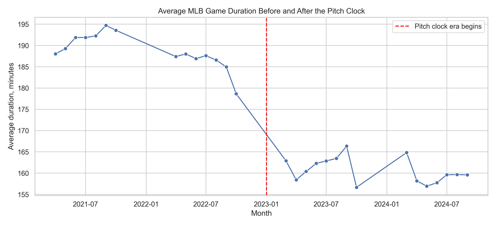
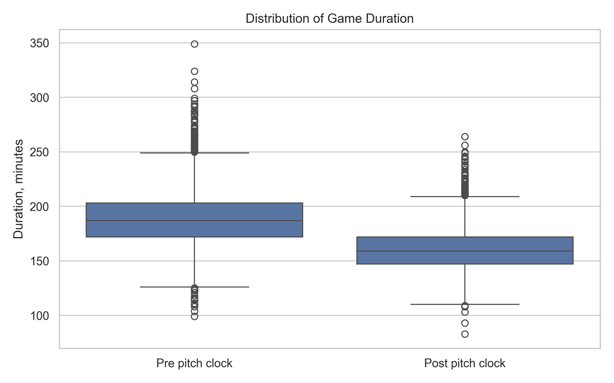
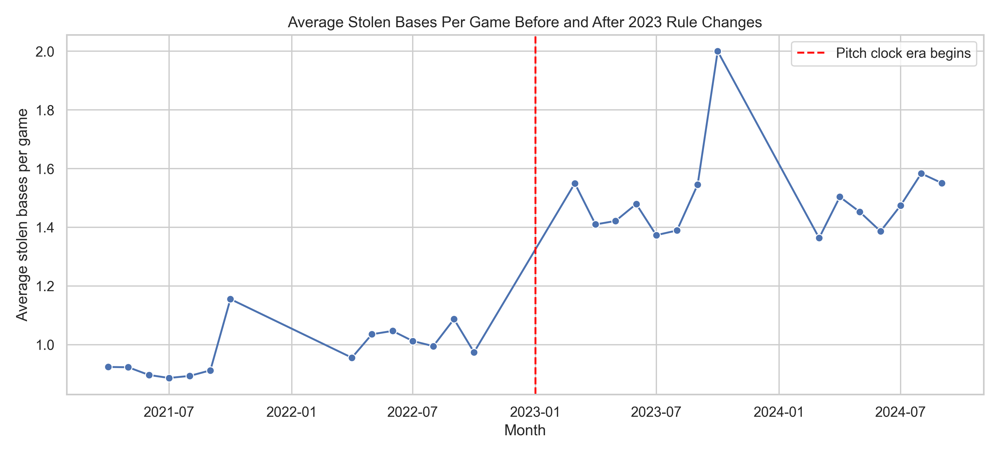

# Project Report: Causal Impact of MLB's Pitch Clock

## Executive Summary

This project estimates the impact of MLB's 2023 pitch clock rule change on regular-season game duration. Using Retrosheet game logs from 2021-2024, the analysis compares pre-rule games to post-rule games and adjusts for observable game characteristics including total runs, game length in outs, attendance, day/night status, month, and ballpark.

**Headline finding:** MLB games became roughly **29-31 minutes shorter** after the pitch clock era began.

A secondary analysis also shows that stolen bases increased by about **0.50 stolen bases per game** after the broader 2023 rule-change environment.

---

## Research Question

> What was the impact of the 2023 MLB pitch clock on average game duration?

## Data

**Source:** Retrosheet regular-season game logs  
**Seasons:** 2021, 2022, 2023, 2024  
**Unit of analysis:** one MLB regular-season game

Primary outcome:

- `duration_minutes`: official game length in minutes

Secondary outcome:

- `total_stolen_bases`: total stolen bases by both teams

---

## Key Results

| Outcome | Method | Estimated Change |
|---|---:|---:|
| Game duration | Naive pre/post difference | **-28.5 minutes** |
| Game duration | Adjusted regression | **-30.5 minutes** |
| Stolen bases | Naive pre/post difference | **+0.50 per game** |
| Stolen bases | Adjusted regression | **+0.50 per game** |

Yearly average game duration:

| Season | Avg. Duration | Median Duration | Avg. Stolen Bases |
|---:|---:|---:|---:|
| 2021 | 191.4 min | 189 min | 0.91 |
| 2022 | 186.6 min | 184 min | 1.02 |
| 2023 | 162.3 min | 161 min | 1.44 |
| 2024 | 158.7 min | 157 min | 1.49 |

---

## Visual Evidence

### Monthly Average Game Duration



### Distribution of Game Duration Before and After the Pitch Clock



### Monthly Average Stolen Bases



---

## Methodology

Because the pitch clock was introduced league-wide, there is no clean untreated MLB control group. This project therefore uses an interrupted time-series style pre/post design.

The analysis includes:

1. **Naive pre/post comparison**
   - Compares average outcomes before 2023 versus 2023 and later.

2. **Adjusted OLS regression**
   - Estimates the post-2023 change while controlling for:
     - total runs
     - official game length in outs
     - attendance
     - day/night game status
     - month fixed effects
     - ballpark fixed effects

3. **Visual trend analysis**
   - Uses monthly averages to show the timing and magnitude of the rule-era shift.

---

## Interpretation

The results strongly suggest that the pitch clock era substantially reduced game duration. The shift is visible immediately in 2023 and remains present in 2024. The adjusted estimate is similar to the naive estimate, which increases confidence that the result is not only due to changes in scoring, attendance, game length, or ballpark mix.

The stolen base increase is also consistent with the broader 2023 rule environment, though it should not be attributed only to the pitch clock because larger bases and pickoff limits were introduced during the same season.

---

## Limitations

- The rule was implemented league-wide, so there is no untreated MLB control group.
- Other 2023 rule changes occurred at the same time.
- The design estimates a sharp before/after association consistent with a causal effect, not a randomized experimental effect.
- Results may not isolate the pitch clock from the full 2023 pace-of-play rule package.

---

## Reproducibility

From the repository root:

```bash
python3 -m venv .venv
source .venv/bin/activate
pip install -r Causal_MLB_Pitch_Clock_Impact/requirements.txt
python Causal_MLB_Pitch_Clock_Impact/src/data_cleaning.py
python Causal_MLB_Pitch_Clock_Impact/src/estimate_effect.py
```

Generated outputs:

```text
reports/tables/yearly_summary.csv
reports/tables/causal_estimates.csv
reports/figures/monthly_game_duration.png
reports/figures/duration_distribution_pre_post.png
reports/figures/monthly_stolen_bases.png
```

---

## Project Structure

```text
Causal_MLB_Pitch_Clock_Impact/
├── data/
├── docs/
├── reports/
│   ├── figures/
│   └── tables/
├── src/
│   ├── data_cleaning.py
│   └── estimate_effect.py
├── requirements.txt
└── README.md
```
