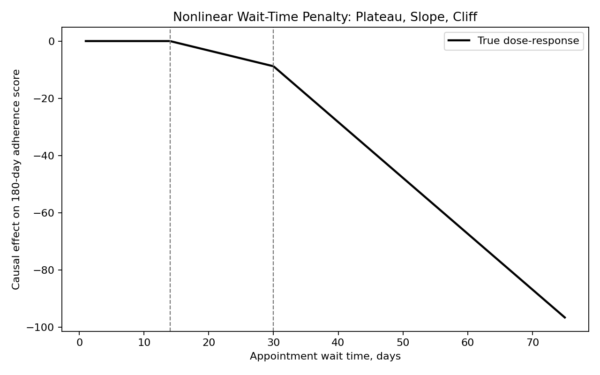
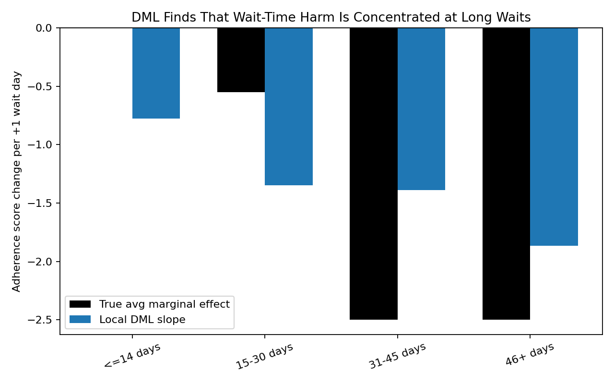
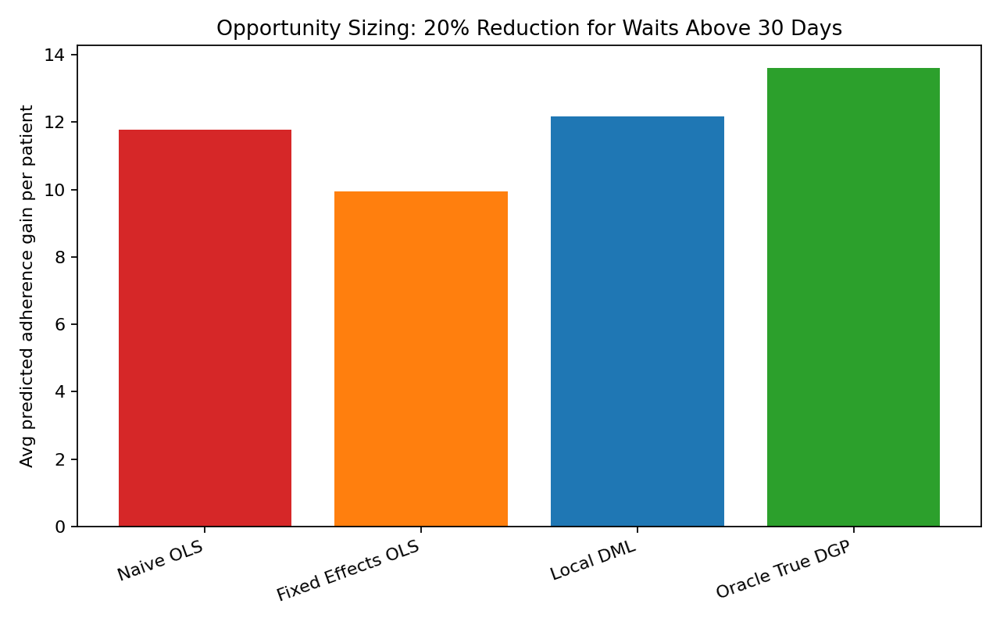
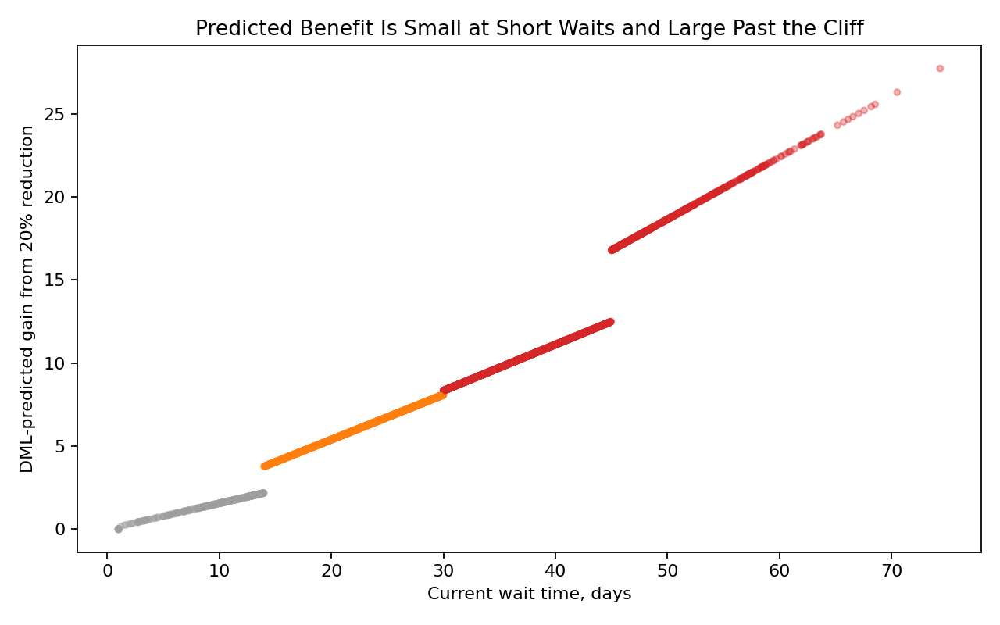

# Double Machine Learning vs Fixed Effects: Healthcare Wait-Time Linear Trap

This portfolio project adapts the “linear trap” idea to a healthcare operations problem.

## Business Question

A healthcare system wants to reduce long appointment wait times. The analytics question is:

> What is the long-term adherence impact of reducing wait times above 30 days by 20%?

The difficulty is that wait-time effects are not linear. Reducing a 7-day wait may not change much, but reducing a 45-day wait can meaningfully improve follow-up adherence.

## Why Fixed Effects Can Still Be a Trap

Fixed effects help address confounding from clinics and specialties. For example:

- Higher-quality clinics may have shorter wait times and better outcomes.
- Some specialties naturally have longer waits and different adherence patterns.
- Urgent referrals may get shorter waits and have different outcomes.

A fixed-effects OLS model can reduce this confounding, but it still estimates one constant slope. That means it spreads the wait-time effect across the whole distribution, including short waits where the true marginal effect is close to zero.

## Simulated Healthcare Setting

The simulation includes 25,000 patient appointments with:

- Clinic fixed effects
- Specialty fixed effects
- Age
- Comorbidity index
- Distance from clinic
- Prior no-show rate
- Medicaid indicator
- Urgent referral indicator
- Appointment wait time
- 180-day adherence score

The true wait-time effect has a nonlinear operational shape:

- `<=14 days`: little/no penalty
- `15-30 days`: moderate penalty
- `>30 days`: steep adherence cliff

## Methods Compared

1. **Naive OLS**
   - Regresses adherence directly on wait time.
   - Biased by clinic, specialty, and patient-selection confounding.

2. **Fixed Effects OLS**
   - Adds clinic and specialty fixed effects plus patient controls.
   - Reduces confounding but imposes one linear wait-time effect.

3. **Local Double Machine Learning**
   - Cross-fits Random Forest nuisance models for:
     - `E[adherence | X]`
     - `E[wait time | X]`
   - Residualizes the outcome and treatment.
   - Estimates local wait-time slopes by wait-time band.

4. **Oracle True DGP**
   - Uses the known simulation ground truth.
   - Included only because this is a simulated portfolio project.

## Current Results

Opportunity sizing for patients currently waiting more than 30 days:

| Method | Avg gain per targeted patient | Total gain |
|---|---:|---:|
| Naive OLS | `11.767` | `160,391.9` |
| Fixed Effects OLS | `9.937` | `135,450.1` |
| Local DML | `12.169` | `165,870.7` |
| Oracle True DGP | `13.594` | `185,304.1` |

Local DML is closer to the oracle than the fixed-effects linear model because it allows the wait-time slope to be steeper for patients beyond the 30-day cliff.

## Visualizations

### True Wait-Time Effect Curve



### DML Local Slopes by Wait Band



### Opportunity Sizing Comparison



### DML-Predicted Gain by Current Wait Time



## Repository Structure

```text
.
├── src/
│   └── dml_healthcare_wait_times.py
├── data/
│   ├── simulated_healthcare_wait_times.csv
│   └── dml_scored_wait_time_intervention.csv
├── artifacts/
│   ├── true_wait_time_effect_curve.png
│   ├── dml_local_slopes_by_wait_band.png
│   ├── opportunity_sizing_comparison.png
│   └── dml_predicted_gain_by_wait_time.png
├── reports/
│   ├── model_results.md
│   ├── dml_local_slopes.csv
│   └── opportunity_sizing.csv
└── requirements.txt
```

## How to Run

```bash
pip install -r requirements.txt
python src/dml_healthcare_wait_times.py
```

If running from the parent `Data_Science` virtual environment:

```bash
../.venv/bin/python src/dml_healthcare_wait_times.py
```

## Portfolio Takeaway

This project shows that fixed effects can solve one problem while leaving another unresolved. They help with confounding, but a linear specification can still mis-size the business opportunity when the real causal response has thresholds or cliffs. Local DML provides a more flexible way to estimate where operational improvements actually matter.
