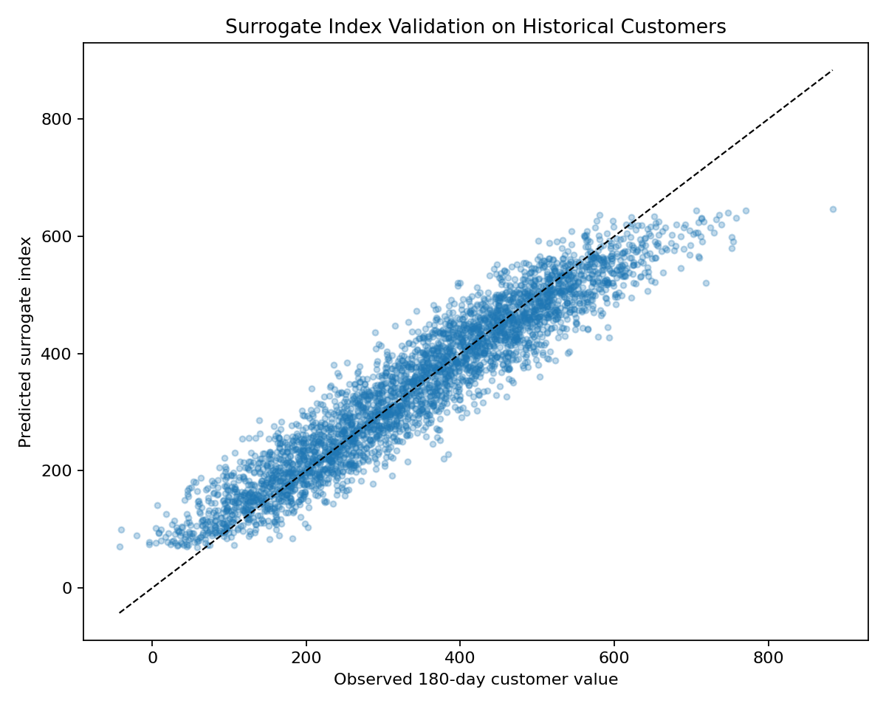
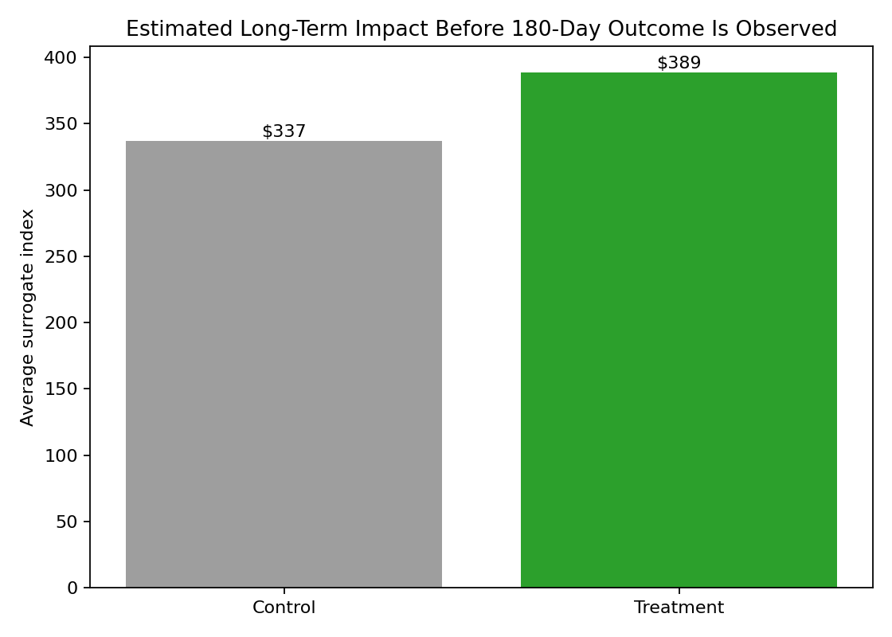
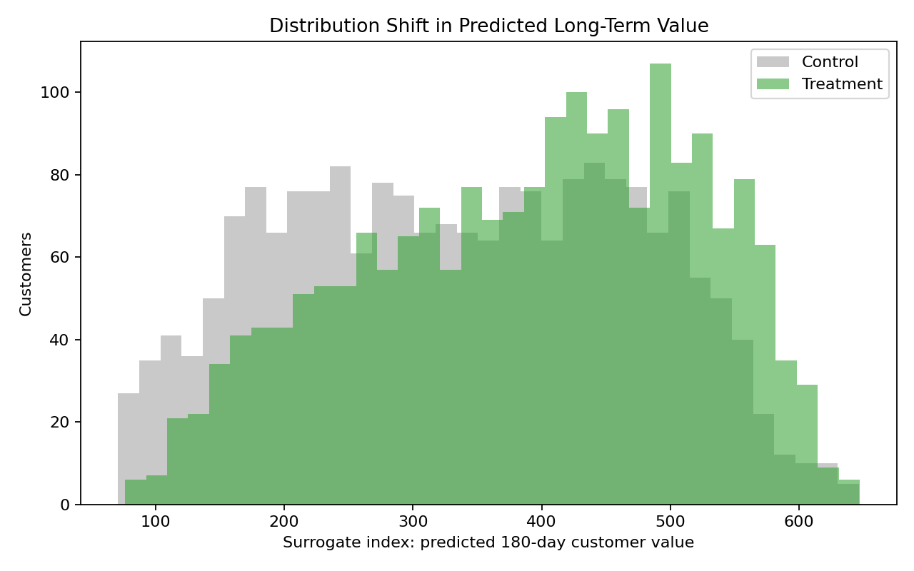

# Surrogate Index for Aquarium Store Treatment Effects

This portfolio project shows how to estimate whether a treatment is likely to improve a long-term business outcome before that outcome is fully observed.

## Business Question

An aquarium store launches a treatment: a **personalized aquarium care plan + coupon bundle**.

The store wants to know:

> Will this treatment increase 180-day customer value?

The challenge is that 180-day customer value takes months to observe. A surrogate index provides an earlier read by combining short-term signals that historically predict long-term value.

## Method

1. Simulate historical aquarium customers with:
   - Baseline customer features
   - Short-term surrogate outcomes
   - Observed 180-day customer value
2. Train a Random Forest surrogate-index model:

\[
\widehat{Y}_{180} = f(X, S)
\]

where `X` is baseline customer information and `S` is short-term surrogate behavior.

3. Simulate a new randomized treatment/control experiment where only short-term signals are available so far.
4. Predict each customer’s surrogate index.
5. Estimate treatment impact using the difference in average surrogate index between treated and control customers.

## Short-Term Surrogates

The surrogate index uses behaviors that happen quickly but are predictive of long-term customer value:

- First 14-day spend
- Water test count in 30 days
- Repeat visit within 30 days
- Livestock purchase within 30 days
- Maintenance subscription within 30 days

## Current Results

Surrogate-index validation on historical customers:

- RMSE: `$49.14`
- MAE: `$38.88`
- R-squared: `0.899`
- Correlation: `0.950`

Estimated treatment effect before the 180-day outcome is available:

- Treatment mean surrogate index: `$388.99`
- Control mean surrogate index: `$337.06`
- Estimated ATE on surrogate index: `$51.93`
- True simulated 180-day ATE for validation: `$56.91`

The true 180-day ATE is included only because this is a simulated portfolio project. In a real experiment, the surrogate index would provide an early read while waiting for the long-term outcome.

## Visualizations

### Surrogate Index Validation



### Estimated Treatment Effect



### Distribution Shift



## Repository Structure

```text
.
├── src/
│   └── surrogate_index_aquarium.py
├── data/
│   ├── historical_customers.csv
│   └── experiment_surrogate_index.csv
├── artifacts/
│   ├── surrogate_index_validation.png
│   ├── surrogate_index_treatment_effect.png
│   └── surrogate_index_distribution.png
├── reports/
│   ├── model_results.md
│   └── surrogate_treatment_effect.csv
└── requirements.txt
```

## How to Run

```bash
pip install -r requirements.txt
python src/surrogate_index_aquarium.py
```

If running from the parent `Data_Science` virtual environment:

```bash
../.venv/bin/python src/surrogate_index_aquarium.py
```

## Portfolio Takeaway

This project demonstrates how surrogate-index modeling can connect short-term experimental outcomes to long-term business value. It is useful when teams need an early read on long-term treatment effects but cannot wait months for the final outcome.
