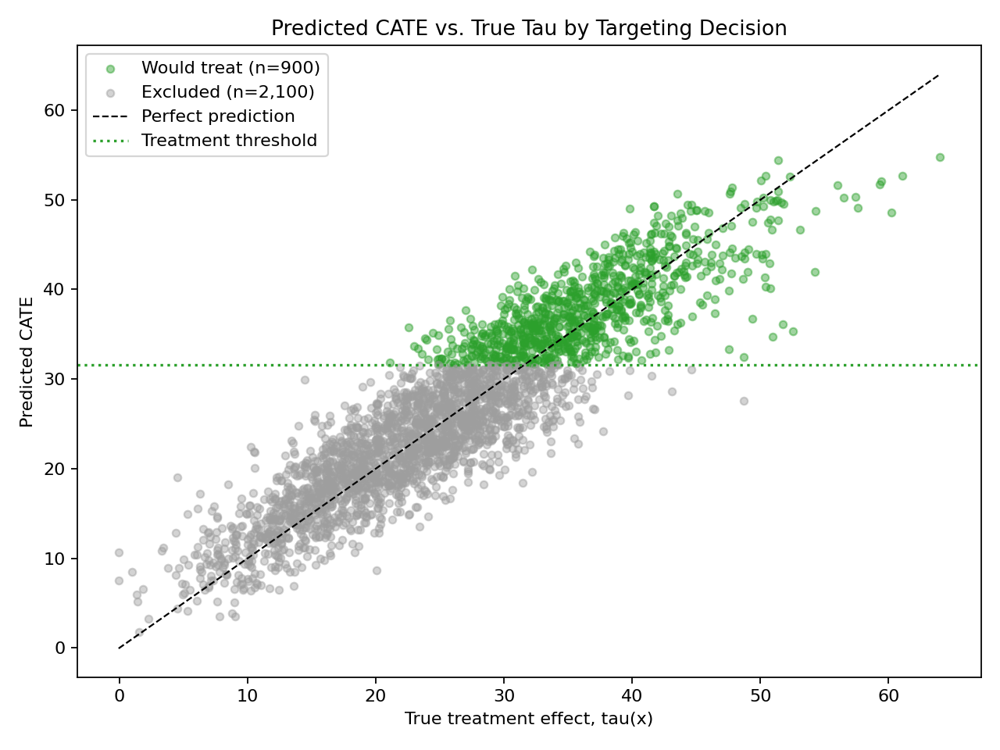
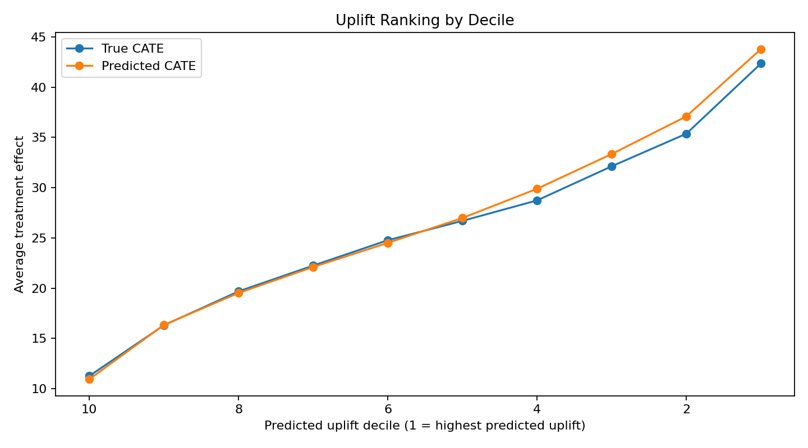

# Uplift Modeling with Random Forests

This portfolio project demonstrates uplift modeling for a simulated marketing campaign. The goal is to estimate the **conditional average treatment effect** (CATE):

\[
\tau(x) = E[Y \mid T=1, X=x] - E[Y \mid T=0, X=x]
\]

Instead of predicting who is most likely to purchase, uplift modeling predicts who is most likely to be **incrementally influenced** by treatment. This is useful for campaign targeting, discount allocation, churn interventions, and product nudges.

## Method

This project uses a **T-learner**:

1. Simulate treatment/control customer data with known heterogeneous treatment effects.
2. Train a `RandomForestRegressor` on treated units only.
3. Train a second `RandomForestRegressor` on control units only.
4. Estimate future-customer uplift:

\[
\widehat{CATE}(x) = \widehat{Y}_1(x) - \widehat{Y}_0(x)
\]

Customers with larger predicted CATE are better candidates for treatment.

## Targeting Policy

The project now includes a simple campaign decision rule:

- Rank holdout customers by predicted CATE.
- Treat the top 30% by predicted uplift.
- Label those customers as `Would treat`.
- Label the remaining customers as `Excluded`.

This creates a practical bridge from treatment-effect estimation to marketing action.

## Current Results

Random Forest T-learner performance on holdout data:

- CATE RMSE: `4.13`
- CATE MAE: `3.29`
- CATE R-squared: `0.821`
- CATE correlation: `0.910`
- True uplift in top predicted decile: `42.35`
- True uplift in bottom predicted decile: `11.27`

Targeting split:

- `Would treat`: 900 customers
- `Excluded`: 2,100 customers

## Visualizations

### Predicted CATE vs. True Tau

This plot compares true treatment effect, `tau(x)`, against predicted CATE. Points are color-coded by the treatment policy:

- Green: `Would treat`
- Gray: `Excluded`



### Uplift by Decile

This chart checks whether the model ranks high-uplift customers above low-uplift customers.



## Repository Structure

```text
.
├── src/
│   └── uplift_random_forest.py
├── data/
│   ├── simulated_uplift_data.csv
│   └── test_predictions.csv
├── artifacts/
│   ├── predicted_vs_true_cate.png
│   └── uplift_by_decile.png
├── reports/
│   ├── model_results.md
│   └── uplift_deciles.csv
└── requirements.txt
```

## How to Run

```bash
pip install -r requirements.txt
python src/uplift_random_forest.py
```

If running from the parent `Data_Science` virtual environment:

```bash
../.venv/bin/python src/uplift_random_forest.py
```

## Outputs

The script generates:

- Simulated experimental customer data
- Holdout CATE predictions with `would_treat` and `policy_group` columns
- Model performance summary
- Predicted CATE vs. true tau chart, color-coded by targeting decision
- Uplift decile chart showing whether the model ranks high-impact customers above low-impact customers

## Portfolio Takeaway

This project shows how causal machine learning can move beyond standard response modeling. A response model asks, “Who will buy?” An uplift model asks, “Who will buy **because of the treatment**?”
