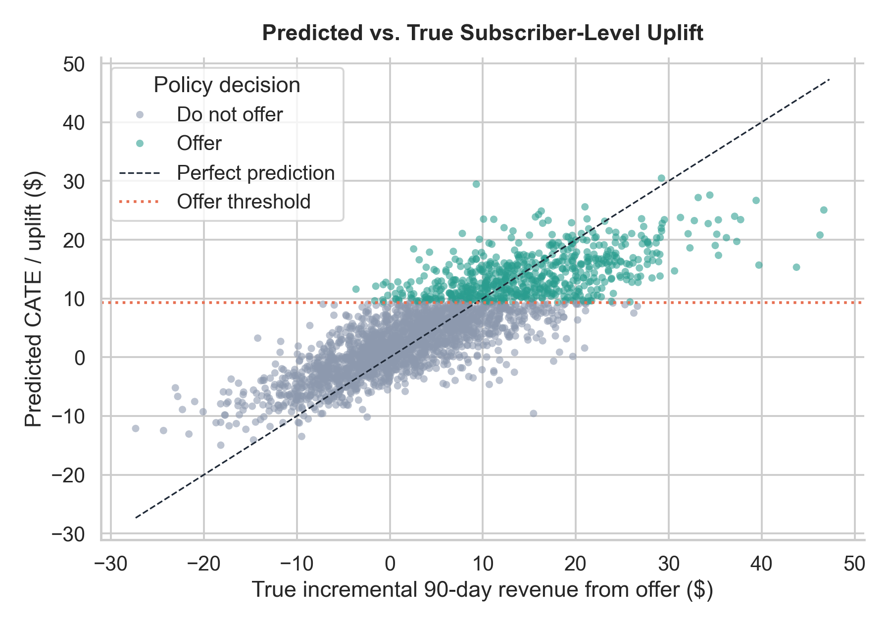
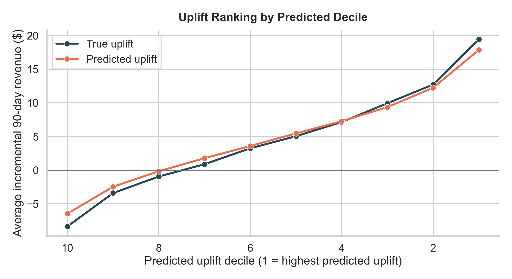
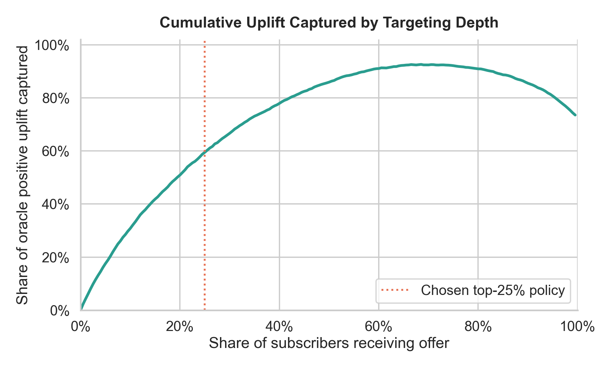
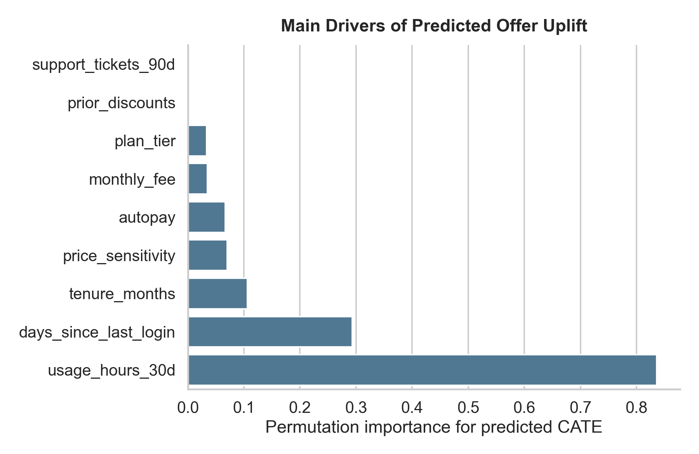

# Subscription Retention Uplift Modeling

This project adapts the reusable [`TLearner`](../model_templates/causal_and_experimentation/uplift/t_learner.py) template to a new synthetic business scenario: a streaming subscription company testing a proactive retention offer.

The modeling question is:

> Which subscribers generate the most incremental 90-day retained revenue because they receive the offer?

This is an uplift problem rather than a standard churn or revenue prediction problem. A high-renewal subscriber is not automatically a good target if they would have renewed without an incentive.

## Scenario

A randomized experiment assigns eligible subscribers to either:

- **Treatment:** receive a proactive save offer before renewal
- **Control:** receive the normal renewal experience

The outcome is `outcome_90d_revenue`. The simulation includes a known `true_cate` so the model can be evaluated like a portfolio teaching example.

Treatment effects are intentionally heterogeneous:

- Stronger for price-sensitive subscribers who still use the product
- Stronger for subscribers with recent support friction
- Weaker for stable autopay subscribers
- Sometimes lower for premium or heavily discounted subscribers because the offer gives away margin

## Method

The project uses a Random Forest **T-learner**:

1. Train one outcome model on treated subscribers.
2. Train one outcome model on control subscribers.
3. Predict both potential outcomes for holdout subscribers.
4. Estimate uplift as:

\[
\widehat{CATE}(x) = \widehat{Y}_1(x) - \widehat{Y}_0(x)
\]

The reusable model template is copied into `src/t_learner.py`, then adapted in `src/subscription_retention_uplift.py` with project-specific simulation, metrics, policy logic, and visual reporting.

## Targeting Policy

The save-offer budget covers the top 25% of holdout subscribers by predicted uplift:

- `Offer`: top predicted CATE quartile
- `Do not offer`: all other subscribers

This turns treatment-effect estimation into an actionable retention decision rule.

## Current Results

Random Forest T-learner performance on holdout subscribers:

- CATE RMSE: `5.38`
- CATE MAE: `4.12`
- CATE R-squared: `0.680`
- CATE correlation: `0.831`
- True uplift in top predicted decile: `$19.43`
- True uplift in bottom predicted decile: `-$8.36`

Policy summary:

- Offer group: `900` subscribers
- Do-not-offer group: `2,700` subscribers
- True incremental value captured by top-25% policy: `$13,526`
- Incremental value vs. random same-size targeting: `$9,417`
- Share of oracle positive uplift captured at 25% targeting depth: `59.5%`

## Visualizations

### Predicted vs. True Uplift

Shows how well the model recovers subscriber-level incremental revenue and highlights the policy threshold.



### Uplift by Decile

Checks whether subscribers ranked highest by predicted uplift also have the highest true incremental value.



### Policy Gain Curve

Shows how much oracle positive uplift is captured as the campaign targets deeper into the ranked subscriber list.



### CATE Feature Importance

Summarizes which pre-treatment features drive predicted treatment-effect heterogeneity.



## Repository Structure

```text
.
├── src/
│   ├── subscription_retention_uplift.py
│   └── t_learner.py
├── data/
│   ├── simulated_subscription_retention_experiment.csv
│   └── holdout_policy_predictions.csv
├── artifacts/
│   ├── predicted_vs_true_uplift.png
│   ├── uplift_by_decile.png
│   ├── policy_gain_curve.png
│   └── cate_feature_importance.png
├── reports/
│   ├── model_results.md
│   ├── uplift_deciles.csv
│   └── policy_gain_curve.csv
└── requirements.txt
```

## How to Run

```bash
pip install -r requirements.txt
python src/subscription_retention_uplift.py
```

From the parent `Data_Science` virtual environment:

```bash
../.venv/bin/python src/subscription_retention_uplift.py
```

## Portfolio Takeaway

The project demonstrates how causal machine learning can improve retention targeting. Instead of asking, “Who is likely to renew?”, the uplift model asks, “Who renews because of the offer, and is therefore worth spending budget on?”
